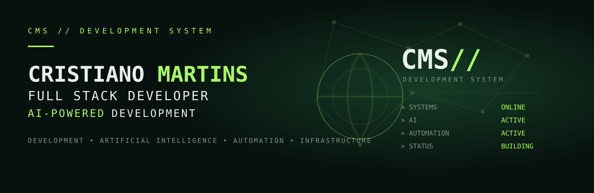
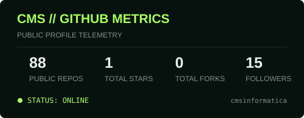

<div align="center">



<br/>

# CMS // DEVELOPMENT SYSTEM

### Cristiano Martins
**Full Stack Developer · AI-Powered Development**

`Development` • `Artificial Intelligence` • `Automation` • `Infrastructure`


</div>

---

## `01 // DEVELOPER_IDENTITY`

```ts
const cristiano = {
  role: "Full Stack Developer",
  approach: "AI-Powered Development",
  building: ["Full Stack Applications", "AI-Powered Solutions", "Workflow Automations", "Systems & Integrations"],
  roots: ["Infrastructure", "Linux", "Networks", "Monitoring & Observability"],
  evolution: "Infrastructure → Automation → Development → AI",
  mindset: "Code. Automate. Deploy. Improve."
};
```

Minha base vem de **infraestrutura e automação de ambientes reais**. Ao longo dessa trajetória, programação deixou de ser apenas uma ferramenta de apoio e passou a ser o centro da construção de aplicações, integrações e soluções inteligentes.

Hoje concentro meu trabalho em **desenvolvimento Full Stack usando Inteligência Artificial**, conectando software, automação e infraestrutura para transformar problemas operacionais em sistemas úteis.

---

## `02 // TECHNOLOGY_MATRIX`

<div align="center">

### `FULL STACK`
     

### `DATA & BACKEND`
  

### `AUTOMATION & INFRASTRUCTURE`
    

</div>

---

## `03 // AI_TOOLKIT`

```text
cms@dev:~$ ./ai-toolkit --status

[ OK ] AI-assisted development
[ OK ] LLM integrations
[ OK ] Multi-model applications
[ OK ] Intelligent workflow automation
[ OK ] AI agents & experimentation
[ OK ] API orchestration

MODE   : BUILD + EXPERIMENT + INTEGRATE
STATUS : ACTIVE
```

A IA faz parte do meu **processo de desenvolvimento** e também das soluções que construo: integração de modelos, roteamento de requisições, automações inteligentes, agentes e experimentação com novas formas de interação entre software e LLMs.

---

## `04 // AUTOMATION_CORE`

Minha experiência com automação conecta desenvolvimento e infraestrutura.

- **n8n** para workflows, integrações e orquestração de serviços.
- **Zabbix + APIs** para monitoramento e resposta operacional.
- **Python** para automação de tarefas de infraestrutura.
- **Telegram / Webhooks / APIs REST** para integração entre sistemas.
- **Docker + Linux** como base de execução e serviços.

```text
INFRASTRUCTURE
      │
      ▼
  AUTOMATION
      │
      ▼
  DEVELOPMENT
      │
      ▼
      AI
```

---

## `05 // FEATURED_PROJECT`

<div align="center">

# 📦 EstoqueFácil
### Sistema Full Stack de Gestão de Estoque
**React 19 · TypeScript · Vite · Supabase · PostgreSQL · RLS · Tailwind CSS**

</div>

Aplicação de gestão de estoque construída para ir além de um CRUD básico, reunindo interface moderna, autenticação, banco de dados relacional, controle de acesso e regras de negócio.

**Destaques técnicos:** autenticação e autorização; PostgreSQL via Supabase; Row Level Security (RLS); funções e regras no banco; dashboards e indicadores; importação/exportação; auditoria; controle de permissões e arquitetura Full Stack com TypeScript.

<div align="center">
<a href="https://github.com/cmsinformatica/EstoqueFacil_NEW-mainNOVO"></a>
</div>

---

## `06 // SELECTED_PROJECTS`

### 🤖 FreeAI Chat
**AI · TypeScript · Express · OpenRouter · Groq**

Aplicação de chat com IA e suporte a múltiplos modelos, streaming de respostas, múltiplas conversas, upload de arquivos e roteamento/classificação de intenção.

[](https://github.com/cmsinformatica/freechat)

### ⚡ Zabbix Telegram Workflow
**Zabbix · n8n · Telegram · APIs · Automation**

Workflow de automação que transforma alertas do Zabbix em interações pelo Telegram, integrando reconhecimento de incidentes, consulta de histórico, atualização de status e resumos operacionais.

[](https://github.com/cmsinformatica/zabbix-telegram-workflow)

### 📋 TaskFlow
**Next.js · React · TypeScript · Supabase · Zustand · Tailwind CSS**

Aplicação de produtividade baseada em quadros Kanban, com workspaces, autenticação, drag-and-drop, labels, checklists e colaboração.

[](https://github.com/cmsinformatica/taskflow)

### 🧁 Gestão para Confeitaria
**React · TypeScript · Vite · Supabase · PostgreSQL · TanStack Query**

Sistema de gestão para pedidos, orçamentos, clientes, catálogo de produtos e acompanhamento do negócio.

[](https://github.com/cmsinformatica/gestao_confeitaria)

---

## `07 // INFRASTRUCTURE_ROOTS`

Antes de aplicações Full Stack e IA, minha trajetória já passava por **servidores, redes, monitoramento e automação**.

Um exemplo dessa base é a automação de **backup de switches com Python**, utilizando SSH para acessar equipamentos Cisco, TFTP para armazenamento das configurações e notificações de execução.

Essa experiência influencia a forma como desenvolvo hoje: não penso apenas na interface, mas também em **integração, operação, disponibilidade, dados e infraestrutura**.

[](https://github.com/cmsinformatica/Backup-de-switches-com-Python)

---

## `08 // LAB_EXPLORATIONS`

```text
> AI Agents
> MCP Servers
> LLM Workflows
> Machine Learning APIs
> n8n Templates
> Observability
> Infrastructure Automation
```

Além dos projetos autorais, mantenho estudos, forks e referências técnicas no GitHub para experimentar tecnologias e acompanhar projetos do ecossistema. **Exploração não é apresentada aqui como autoria.**

---

## `09 // SYSTEM_METRICS`

<div align="center">


<br/>

</div>

> GitHub language cards represent repository composition and do not necessarily indicate proficiency level.

---

## `10 // SYSTEM_TERMINAL`

```bash
cms@network:~$ ./profile --status

[ OK ] Infrastructure initialized
[ OK ] Development environment loaded
[ OK ] Automation services running
[ OK ] AI modules connected

OPERATOR    : Cristiano Martins
SYSTEM      : CMS // DEVELOPMENT SYSTEM
ROLE        : Full Stack Developer
APPROACH    : AI-Powered Development
FOCUS       : Development | AI | Automation | Infrastructure
AUTOMATION  : ACTIVE
AI          : ACTIVE
STATUS      : ONLINE

cms@network:~$ _
```

---

## `11 // CONNECT`

<div align="center">

### `ESTABLISH CONNECTION`
<a href="https://github.com/cmsinformatica"></a>
<a href="https://www.linkedin.com/in/cmsinformatica/"></a>
<a href="https://www.cristianomartins.net/"></a>

<br/><br/>

`CMS // DEVELOPMENT SYSTEM`  
**Code. Automate. Deploy. Improve.**

</div>
